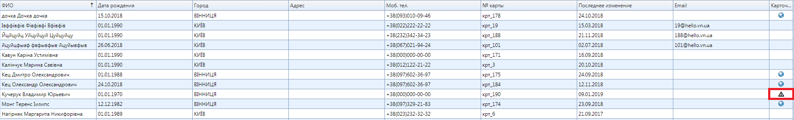

# Чёрный список пациентов

 Добавление пациента в чёрный список осуществляется следующим образом.  
 В списке пациентов нажать правой копкой на пациента и выбрать в контекстном меню поле “Добавить в черный список”. Описав причину и нажав кнопку “Добавить” , вы добавляете пациента в черный список:
       
Увидеть, что пациент уже в черном списке можно по значку в списке пациентов
 
 а также в карточке пациента во вкладке "Подробнее о пациенте":
 