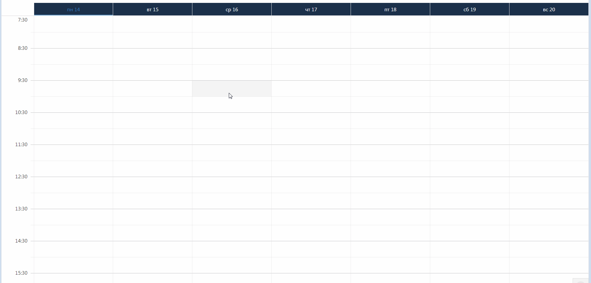

# График работы врачей 

 Чтобы создать график работы, выберете нужный филиал клиники и интервал дат, на который будет создаваться график. Нажмите на нужный интервал  времени дважды или протяните от начала рабочего дня до конца и нажмите Enter, чтобы открыть окно создания графика.    
    
    Здесь можно изменить время начала, время конца рабочего дня; выбрать кабинет, в котором будет производиться прием; врача, для которого составляется график; приблизительную продолжительность приема; активировать или нет добавление без проверки доступности врача; а также вариант создания графика - на выбраную дату, повторить на каждый день до конца недели или месяца.   
    Также сверху можно отфильтровывать отображаемые графики по кабинетам и врачам.  

*Новый график работы будет доступен для записи на онлайн-сайте клиники через 15 минут после создания.*

## Экспорт графика работы врачей  
В этой вкладке можно выбрать за какой период отображать графики работы врачей на отдельном филиале. Далее столбцы таблицы можно перетягивать вверх для группировки данных по нему. Нажимая на иконку экспортировать, вы можете выбрать экспортировать ли все или только выбраные строки. Выбраные данные экспортируются на ваш компьютер в виде файла с расширением Excel.