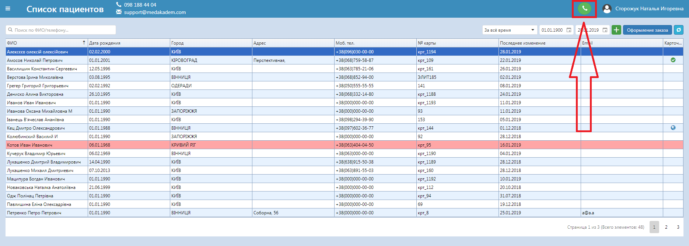
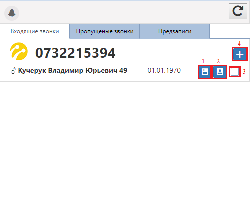
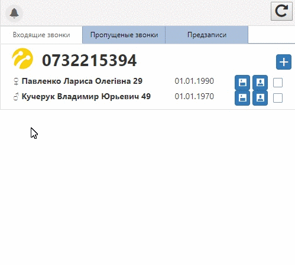
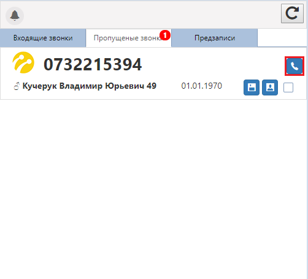

# IP телефония
Для активизации этой функции убедитесь, что введен номер бинотела в настройках пользователя, на который будут осуществляться звонки, и нажмите на соответствующий значок активности:

Чтобы открыть окно звонков, нажмите на колокольчик в правом нижнем углу в программе. Здесь видно кто звонит в данный момент, пропущенные звонки, а так же предзаписи, оформленные пациентом через онлайн-сайт.       
  
Назначение кнопок в окне модуля колл-центра на вкладке входящих звонков:      
     
1. Позволяет копировать данные о пациенте (ФИО, телефон и дату рождения) для удобной работы с пациентом, а также на странице предзаписи при нажатии этой кнопки конкретный пациент сразу выбирается без поиска его по базе, что дает возможность быстро сделать предварительную запись.
2. Дает возможность быстро и без поиска по базе перейти в карту пациента.
3. Если по входящему номеру телефона найдено несколько карточек пациентов, выберите нужную, отметив ее "галочкой".     

  

4. Если звонит новый пациент, отображается его номер, и на основе этого можно создать карточку пациента, нажав на эту кнопку. Когда звонят с номера, зарегистрированного в базе, отображаются привязанные к нему ФИО, телефон, пол, возраст, дата рождения, адрес проживания (если таковы имеются).       

Назначение кнопок в окне модуля колл-центра на вкладке пропущенных звонков те же, но на месте кнопки создания нового пациента есть кнопка осуществления звонка. То есть после нажатие этой кнопки инициируется вызов данного номера с телефона, привязанного к пользователю.

  
Также на вкладках пропущенных звонков и предзаписей, осуществленных через онлайн-сайт, есть возможность перезвонить пациенту. На вкладке предзаписей видно дату и время, обследующего врача записался пациент.   

*Набрать пациента можно также со вкладки оформление предзаписи.*