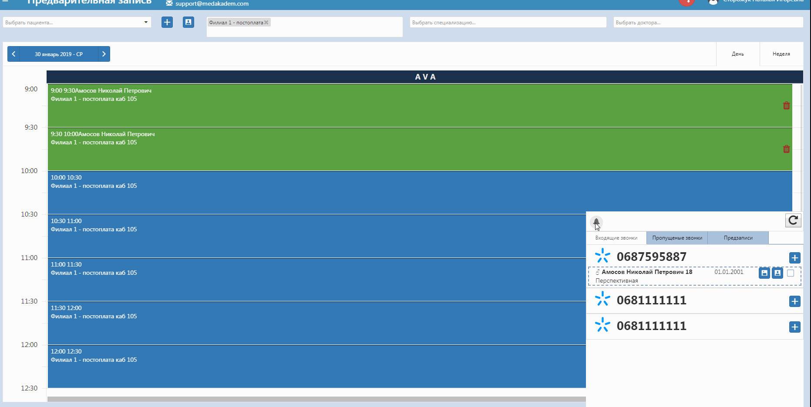

# IP телефония

Для активизации этой функции убедитесь, что введен номер бинотела в настройках пользователя, на который будут осуществляться звонки, и нажмите на соответствующий значок активности:

Чтобы открыть окно звонков, нажмите на колокольчик в правом нижнем углу в программе. Здесь видно кто звонит в данный момент, пропущенные звонки, а так же предзаписи, оформленные пациентом через онлайн-сайт.   
Если звонит новый пациент, отображается его номер, и на основе этого можно создать карточку пациента. Когда звонят с номера, зарегистрированного в базе, отображаются привязанные к нему ФИО, телефон, пол, возраст, дата рождения, адрес проживания (если таковы имеются). Тут появляется опция открыть карточку пациента, а также опция скопировать некоторые из данных - ФИО, телефон и дату дождения. Последняя создана для того, чтобы при открытии, например, вкладки "Предзапись", эти данные подставлялись автоматически.  

  
Также на вкладках пропущенных звонков и предзаписей, осуществленных через онлайн-сайт, есть возможность перезвонить пациенту. На вкладке предзаписей видно дату и время, обследующего врача записался пациент.   
При создании пациента автоматически подставляется номер, базовая дата рождения и стандартный город проживания. Стандартный город можно изменить в настройках пользователя. ФИО являются обязательными полями для заполнения.