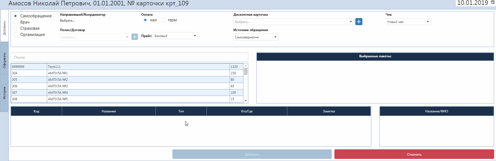
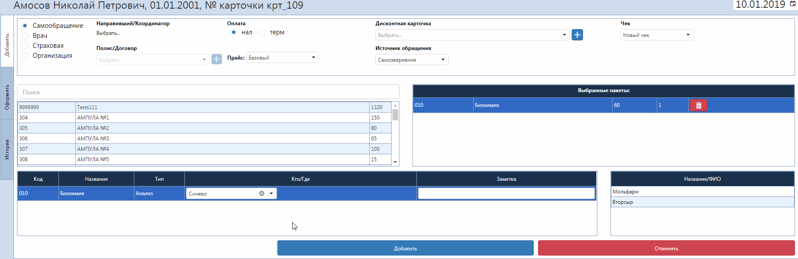

# Оформление заказа

Выбрав в списке пациентов нужного и нажав кнопку "Оформление заказа", вы открываете вкладку добавления предоставляемой услуги пациенту с указанием :  

1. даты, на которую оформляется выполнение заказа
2. вида обращения (Самообращение, Врач, Страховая или Организация)
3. направившего/координатора в случае направления от врача/страховой компании 
4. номера полиса/договора в случае направления от страховой компании/организации   
Тут можно добавить в базу новый полис/договор, кликнув на значок "+"
5. вида оплаты (безналичные, наличные, наличные по франшизе, терминал, терминал по франшизе)
6. прайса, по которому проходит эта услуга
7. номера дисконтной карты
8. источника обращения (откуда пациент узнал про клинику)
9. чека (создать новый чек или добавить к уже существующему)
10. услуги, которая будет оказываться пациенту  
Услугу можна найти с помощью соотвественного поля при вводе либо кода услуги, либо названия. При введении кода услуга добавляется автоматически. При введении названия необходимо кликнуть по нужной услуге.
  
  
Далее необходимо указать обследущего врача или же лабораторию для проведения анализов в зависимости от типа выбраной услуги. В части "Выбраные пакеты" отображаются все выбраные услуги для даного пациента. В части "Назавние/ФИО" отображаются врачи, которые также могут проводить даное обследование или же другие лаборатории, которые могут провести такие анализы.  

После нажатия на кнопку "Добавить" открывается вкладка "Оформить".  
Тут открывается вкладка "Заказы", в которой можно проставить скидку для пациента в процентном или денежном эквиваленте, что сразу же отобразится на общей сумме. Также можно оформить эти услуги пациенту в долг. В последующих вкладках можео изменить ранее внесенные данные. Также во вкладке "Обследования" возможно выбрать время, на которое записать пациента к этому врачу. Или же выбрать опцию "в порядке очереди", тогда пациент попадет в окно живой очереди на странице приема врача.  
Во вкладке "История" отображается история обращений пациента.

Далее нужно нажать кнопку "Сохранить".
