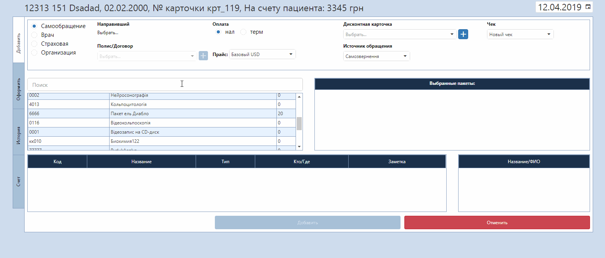

# Оформление заказа

Выбрав в списке пациентов нужного и нажав кнопку "Оформление заказа", вы открываете вкладку добавления предоставляемой услуги пациенту с указанием :  

1. даты, на которую оформляется выполнение заказа
2. вида обращения (Самообращение (пациент пришел сам), Врач (направил врач), Страховая или Организация(направили страховые компании или организации))
3. направившего врача в случае направления от врача/страховой компании    
Воспользуйтесь быстрым добавлением направившего, кликнув на значок "+". Полный список направивших можно создать в справочнике <a href="./ReferringDoctors">"Направившие врачи"</a>.
4. номера полиса/договора в случае направления от страховой компании/организации   
Тут можно добавить в базу новый полис/договор, кликнув на значок "+".
5. вида оплаты (безналичные, наличные, наличные по франшизе, терминал, терминал по франшизе)
6. прайса, по которому проходит эта услуга
7. номера дисконтной карты
8. источника обращения (откуда пациент узнал про клинику)
9. чека (создать новый чек или добавить к уже существующему, если сегодня ранее уже оформлялись услуги на данного пациента)
10. услуги, которая будет оказываться пациенту  
Услугу можно найти с помощью соответственного поля при вводе либо кода услуги, либо названия. Если код или название являются уникальными и совпадений с другими услугами нет, услуга добавится автоматически. Если нашлись совпадения с другими услугами, необходнимо выбрать нужную, кликнув на нее.
  
  
Далее необходимо указать обследующего врача или же лабораторию для проведения анализов в зависимости от типа выбранной услуги. В части "Выбранные пакеты" отображаются все выбранные услуги для данного пациента. В части "Назавние/ФИО" отображаются врачи, которые также могут проводить даное обследование или же другие лаборатории, которые могут провести такие анализы. Врачи здесь будут отображаться, если совпадает специализация услуги и специализация врача. Также в выбранной услуге в поле Кто/Где нужно выбрать врача или лабораторию. Здесь, в выпадающем списке отображаются все пользователи программы.      
После выбора услуги и врача активируется кнопка "Добавить", которая добавляет пациенту услугу. На этом этапе услуга уже появится в карте пациента, далее следует лишь редактирование информации о ней - цена, скидки, долг и др.  

После нажатия на кнопку "Добавить" открывается раздел "Оформить".  
Тут открывается вкладка "Заказы", в которой можно поставить скидку для пациента в процентном или денежном эквиваленте, что сразу же отобразится на общей сумме. Также можно оформить эти услуги пациенту в долг, если пациент хочет расчитатся позже. Программа будет считать, что услуга проводилась, но оплата ещё не произошла. Отслеживать пациентов с долгом можно по Отчёту по долгам. Оттуда можно сразу перейти обратно на страницу Оформления заказа и снять Долг, что будет означать, что оплата произошла и из отчёта по долгам этот пациент пропадет.

Отдельно можно указать <a href="./coordinator">координатора</a>, который гарантирует визит. Выбрать координатора можно только после добавления услуги.
Так же направившие и координаторы не будут пересекаться и доступны в соответствующих справочниках и отчетах.    

В последующих вкладках можно изменить ранее внесенные данные. Также во вкладке "Обследования" возможно выбрать время, на которое записать пациента к этому врачу. Или же выбрать опцию "в порядке очереди", тогда пациент попадет в окно живой очереди на странице приема врача.  
В разделе "История" отображается история обращений пациента.   
Раздел "Счет" описан <a href="./count">на этой странице</a>.

Далее нужно нажать кнопку "Сохранить".

