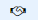
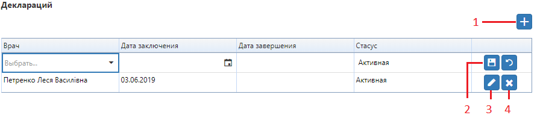

# Карточка пациента

На вкладку "История обращений" выводятся все услуги предоставленные пациенту за все время, указывая на дату приёма, название услуги, диагноз, код услуги по МКБ, обследующего врача, направившего врача и цену услуги. Здесь можно распечатать выбранные протоколы или результаты анализов.

В "Подробнее о пациенте" можно изменить нужную информацию, <a href="./verification">верифицировать</a> телефон пациента, увидеть предварительные записи этого пациента, его непогашенные долги и заключенные декларации с врачами, а также был ли пациент добавлен в <a href="./BlackList">чёрный список</a>.    
*Отметку о заключенных декларациях можно сделать здесь же, нажав на "+" [1]. Выберете врача, с которым была заключена декларация и дату заключения, нажмите кнопку сохранения [2]. Созданную декларацию можно аннулировать, нажав на "х" [4] или редактировать [3]. Также отметку    о том, что у пациента заключена декларация можна увидеть на следующих страницах:*   
- *список пациентов*
- *приём врача (врач отображается при наведении на знак  )*
- *оформление предварительной записи (врач отображается при наведении на знак  )*
- *в открытом окне предзаписи в строке с ФИО*

    

На вкладке "Анализы" можно увидеть результаты анализов, а также другую информацию о проведенных анализах.  
В "Обследованиях/УЗИ" врач может заполнять заключения или рекомендации для проведенной услуги, <a href="./drugs">составлять рецепты на лекарства</a>, прикреплять снимки или другие файлы. Кнопка "Готов" означает, что врач закончил работу над даным протоколом и дальнейшее редактирование будет блокировано. Также в карте пациента можно добавлять <a href="./anamnez">анамнезы</a> пацентов на соответствующей вкладке.   
Также существует возможность просматривать журнал действий по данной карточке пациента.    

