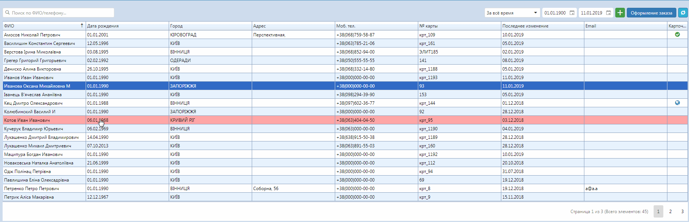

# Объединение пациентов  

Если требуется объединить две карточки пациента, нажмите в списке пациента на нужного правой кнопкой и выбирете в контекстном меню "Объеденить карточки". В выплывающем окне выбирете карточку, которая интегрируется в выбраную.
