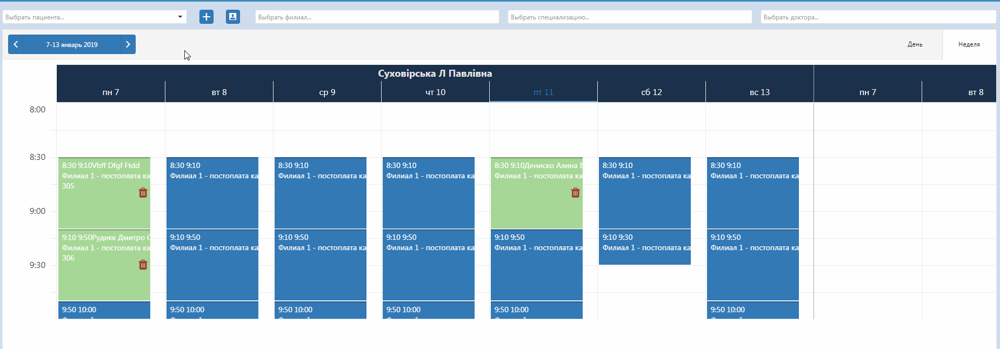

# Предварительная запись

В даном окне регистратор может записывать пациентов к врачу. Выбрав пациента, филиал,и дату отображения, кликнуть на нужное время записи. Можно фильтровать отображаемых врачей по специализации либо по фамилии.   
Здесь же можно удалить предзапись, нажав на соответствующую иконку на самой предварительной записи.
Также из этого окна можна создать пациента, кликнув на "+", или перейти в карточку существующего пациента, кликнув на иконку КП.

   