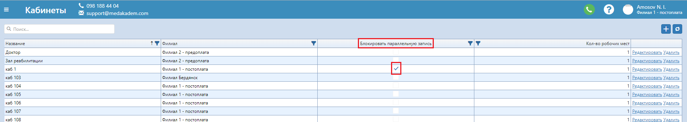

# Предварительная запись

В даном окне регистратор может записывать пациентов к врачу.    
Здесь отображаются созданные графики работы врачей по выбранному филиалу, а также (необязательные фильтры) по специализации и по фамилии доктора.    
Свободные интервалы для записи отображаются синим цветом.    
Чтобы записать пациента, просто выберите из списка нужного и щелкните на свободный интервал. Добавить детали предзаписи можно кликнув еще раз на предзапись. В открывшемся окне можно сразу выбрать услугу, которая будет предоставляться, и эта услуга автоматически отобразится в оформлении заказа. Здесь же можно изменить время предзаписи, ее продолжительность, выставить статус, который будет отображаться специальным значком на странице Предварительная запись и Оформление предзаписи; заполнить информацию о направивших врачах, страховых полисах, если таковы имеются. Можно так же изменить кабинет, в котором будет проводится услуга. *Есть возможность заблокировать создание предзаписи на одну услугу на то же время в одном кабинете.*   <button onclick='showText()'>Как это сделать</button>

На вкладке "Кабинеты" в Настройках выберите нужный кабинет и поставьте отметку о блокировании паралельной предзаписи

В том же окне редактирования предзаписи есть кнопка перехода сразу в оформление заказа. Как и на странице Оформление предзаписи, надпись на кнопке означает название прайса, по которому будет оформляться заказ. Если пациент записан к нескольким специалистам, удобно переходить в оформление этих предзаписей не производя поиск по всей странице предварительной записи, а просто в одной из его предзаписей перейдите на вкладку Предзаписи - здесь отобразятся другие записи пациента - нажмите на такие же кнопки Оформить, как описанные выше.

Предзаписи можно копировать/вырезать со всех заполненой информацией о них на любой другой свободный день и время, к любому врачу. На другой филиал предзаписи копируются без дополнительной информации (только ФИО пациента). Щелкните правой кнопкой на предзаписи, которую нужно копировать, выберите нужный вариант копирования и кликните на любой свободный интервал.       
 
Вы можете изменить цвет занятых интервалов для страницы предварительной записи: просто перейдите на вкладку Настройки -> Филиалы и двойным щелчком откройте редактирование филиала.   

Здесь же можно удалить предзапись, нажав на соответствующую иконку на самой предварительной записи.
Также из этого окна можна быстро создать пациента, кликнув на "+", или перейти в карточку существующего пациента, кликнув на иконку КП рядом с кнопкой добавления.

   

 