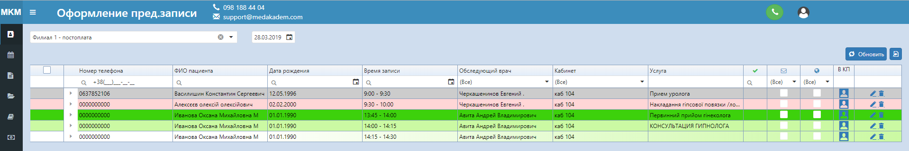
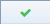
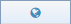
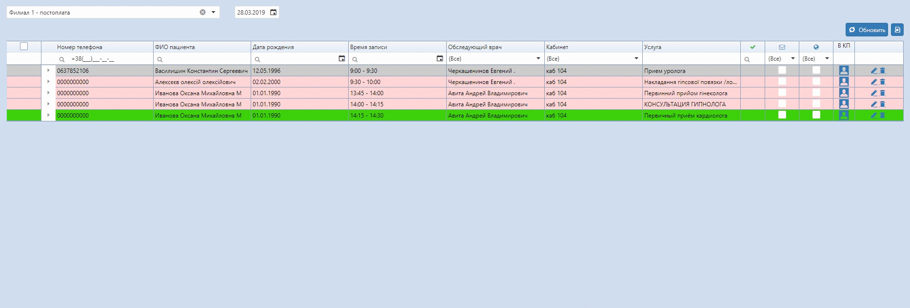

# Оформление предварительной записи

Здесь отображается список предварительно записаных пациентов на выбраном филиале в определенный день. По умолчанию отображаются пациенты, записанные на сегодня.    
На этой вкладке удобно искать пациентов, которых нужно оформить.

Обозначение цветов:
- зеленый - сейчас идет прием;
- светло-зеленый - близится время приема;
- светло-зеленый с градиентом - при предзаписи не выбрана услуга, и время приема не наступило;
- серый - услуга оформлена;
- красный - время приема прошло и услуга не оформлена.

Колонка  показывает подтвердили ли запись, то есть поставили ли в предзаписи статус "Подтвердили".   
Следующий столбец показывает отправляли ли пациенту СМС.    
Колонка  позволяет определить была ли эта предзапись сделана через онлайн-сайт.   
Кнопки в столбце "В КП" позволяют перейти в крату пациента.   
Развернув предзапись, можно перейти в оформление заказа. Если была выбрана услуга, она сразу отобразится, как и обследующий врач.  
 
