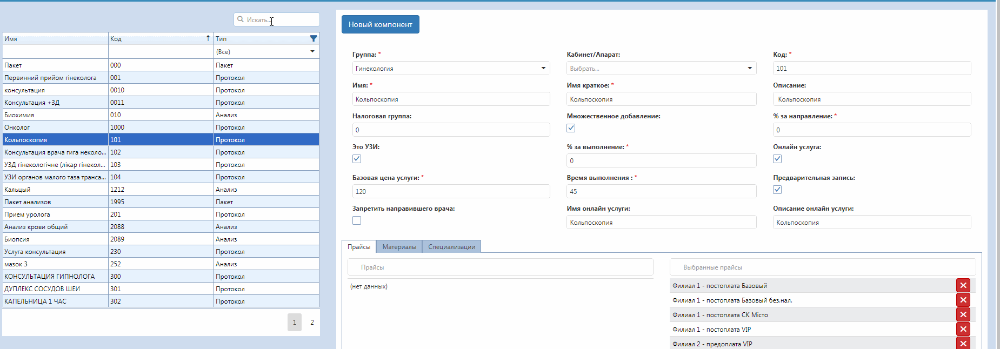

# Услуги (краткий)

Услуги (краткий) содержит список существуемых услуг и дает возможность создания новой.  
Вводя в поле "Искать" код или часть названия услуги, можно найти нужную и редактировать ее.

Для создания новой услуги нужно выбрать:
 - Группа (группа услуг, к которой будет относится новая)
 - Кабинет/Апарат (где будет оказываться эта услуга)
 - Код (код услуги должен быть индивидуальным для каждой)
 - Имя (название услуги)
 - Имя краткое
 - Описание
 - Тип услуги (протокол, анализ или пакет)
 - Налоговая группа
 - Множественное добавление (можно ли добавлять этот анализ несколько раз за день одному пациенту)
 - Предварительная запись (можно ли предварительно записываться на эту услугу)
 - % за выполнение (% от цены услуги, который получает обследующий врач)
 - % за направление (% от цены услуги, который получает направивший врач)
 - Базовая цена услуги
 - Время выполнения (приблизительное время предоставления услуги)
 - Запретить направившего врача
 - Онлайн услуга
 - Прайсы
    - Прайсы
    - Выбранные прайсы
    - Сохранить
 - Материалы
    - Тип материала
    - Количество, кратная единица измерения
    - Сохранить  
    
Добавление услуг
- Пакет

- Протокол 

- Анализы 
