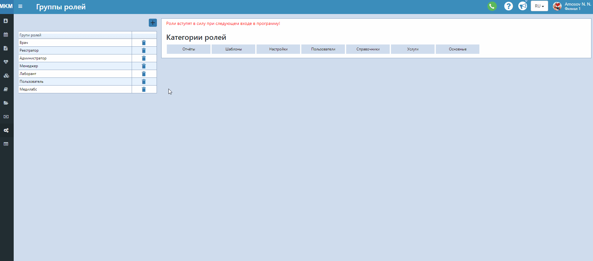

# Группы ролей

На этой странице можно создавать разные группы ролей (прав доступа). Группы нужны для того, чтобы ограничить доступ пользователей к каким-то данным. К примеру, можно создать группы Регистратор, Врач, Директор.    
Одному пользователю можно назначать несколько групп ролей. Роли при этом будут суммироваться.    
При редактировании группы ролей (добавлении или удалении каких-то отдельных прав) ко всем пользователям с этой группой автоматически применится обновление.    
Для того, чтобы создать группу ролей, сделайте следующее:
1. Нажмите на кнопку "+".
2. В открывшуюся строчку введите название группы. Нажмите на кнопку Сохранить.
3. Кликните на нужную группу и справа выберите "галочкой" нужные права доступа. Они сохранятся автоматически.   
