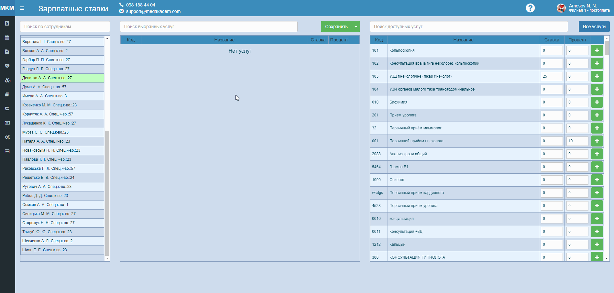
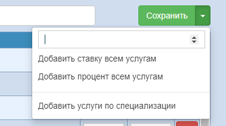
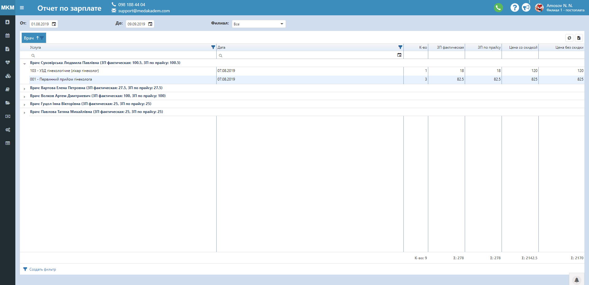

# Расчет зарплаты врачу

Чтобы воспользоваться удобным модулем расчета отчислений врачу за выполненные услуги, заполните необходимые данные для успешной работы программы.
1. Зайдите на страницу "Отчисления врачу" в разделе меню Справочники.     
    
2. Здесь Вы видите три списка. Список слева отображает пользователей программы с количеством их специализаций. В списке справа показаны все услуги или услуги, которых нет у выбранного пользователя.   
    - Найдите нужную услугу с помощью поля поиска доступных услуг.
    - Нажмите на знак "+", чтобы добавить пользователю эту услугу. Это будет означать, что данный пользователь (врач) будет оказывать данную услугу.
    - Чтобы добавить услугу всем пользователям, нажмите правой кнопкой мыши на нужную услугу в списке справа и выберите Добавить всем врачам.
3. Далее выбранная услуга появится в среднем списке. Здесь можно выставить отчисления врачу за данную услугу двумя способами - ставку в виде фиксированной суммы или процента от суммы. Выставить ставку или процент для услуги, которая добавляется всем, можно сразу в списке справа.
4. Нажмите кнопку сохранить сверху над средним списком.
5. Справа возле кнопки Сохранить нажатием на "стрелочку" можно открыть выпадающий список с дополнительными функциями.    
    

        

            <ul>
                <li>Добавить ставку/процент всем услугам - добавляет указанную сумму всем услугам конкретного выбранного врача.</li>
                <li>Добавить услуги по специализации - добавляет выбранному врачу услуги, привязанные к специализации, которая указана у данного врача.</li>
            </ul> 
        

        

    
   
6. Теперь можно отследить начисления врачу в специальной Зарплатной ведомости, которая находится в разделе меню Отчёты.    
    
    Здесь отображены:   
    - услуги с группировкой по врачам, услугам или дате;
    - даты проведения услуг с возможностью фильтрации;
    - количество проведенных услуг;
    - общие суммы за оформленные услуги со скидкой и без;
    - рассчитанные суммы в зависимости от выставленного процента или ставки - ЗП фактическая рассчитывается от суммы со скидкой, ЗП по прайсу рассчитывается от полной стоимости услуги.
Данные из отчета можно экспортировать на Ваш компьютер в формате Excel, нажав на значок .  