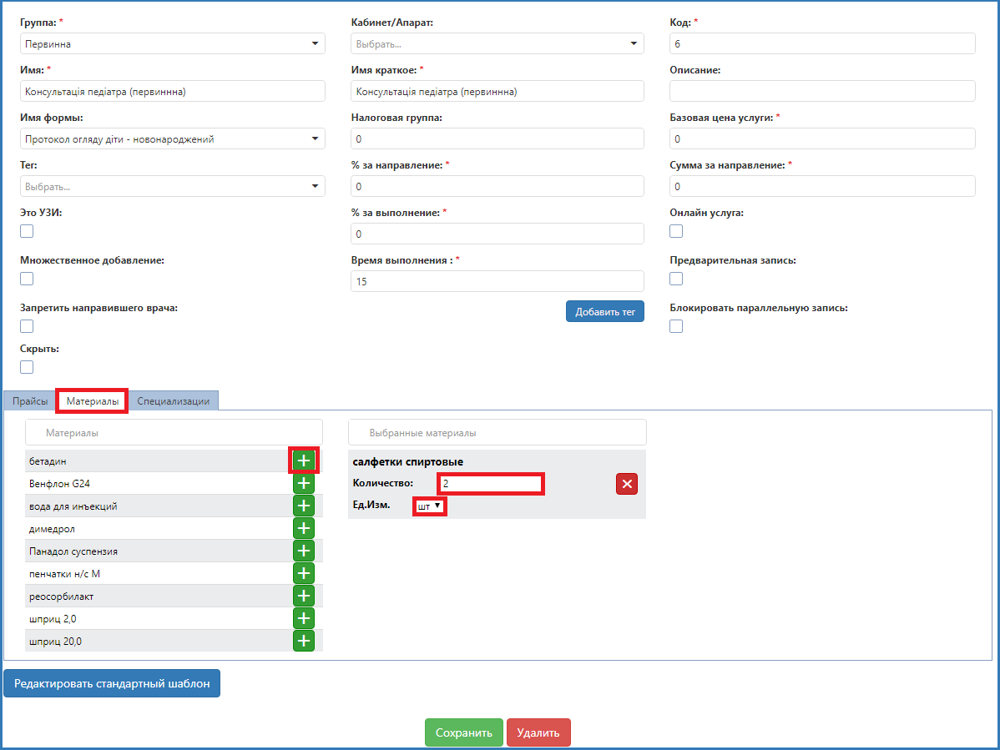
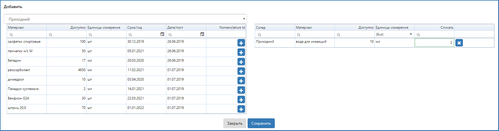

# Прикрепление расходных материалов к услуге

Чтобы определенное количество расходных материалов списывалось автоматически, прикрепите их к услуге. Сделать это можно следующим образом:   
1. На вкладке Услуги (краткий) найдите нужную услугу и щелкните на нее.
2. В открывшемся окне редактирования кликните на вкладку Материалы.
3. Добавьте нужные типы материалов, нажав на "+".
4. Укажите количество и единицу измерения списываемого материала.

Если требуются дополнительные материалы при оказании услуги конкретному пациенту, прикрепите их так:    

1. В карте пациента откройте нужную услугу и кликните на вкладку Расходные материалы.
2. Нажмите Добавить.
3. В открывшемся окне выберите склад, с которого будут списаны материалы, тип материала, нажмите "+".
4. В добавленом материале введите количество, которое нужно списать.
5. Сохраните.

