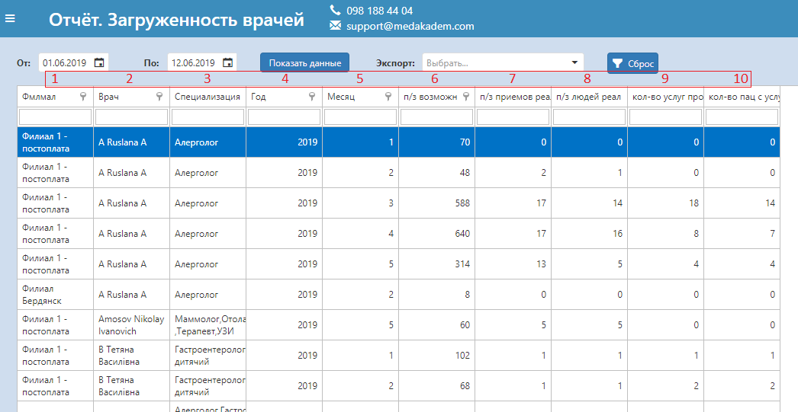

# Отчет по загруженности врачей

С помощью аналитического отчета по загруженности врачей удобно отслеживать нагрузку на каждого специалиста помесячно. Выберите период отображения данных и нажмите "Показать данные". В каждом столбце можно фильтровать информацию по выбранному значению. Все фильтры можно сбросить одной кнопкой "Сброс". Этот отчет, как и другие в программе можно экспортировать на Ваш компьютер.   

- Первый столбец этого отчета показывает в каком филиале работает данный специалист. Далее следуют столбцы отображающие ФИО врача и его специализацию.

- С помощью столбца "4" и "5" можно фильтровать данные по нужному периоду работы врачей.    
- Столбец "6" отображает количество возможных предзаписей исходя из созданных графиков работы и выставленных в них продолжительностей приема врача. То есть если, например, был создан график работы врача 5 дней в неделю, с 9 до 18:00, с продолжительностью приема в 60 мин; то количество возможных предзаписей будет 180.    
- Столбец "7" отображает реальное количество предзаписей - занятых интервалов. Это число может больше или меньше числа возможных - интервал был разбит на несколько предзаписей в первом случае, и интервал не был занят во втором.   
- Столбец "8" показывает количество людей (пациентов) записанных по этим предзаписям. Это количество может быть ментьше реального количества предзаписей, так как один пациент мог быть записан несколько раз.    
- Столбец "9" отображает количество оформленных услуг по этому врачу за выбранный период.     
- Столбец "10" позволяет видеть количество пациентов, которые реально пришли на прием и на них были оформлены услуги. Может быть меньше или больше количества записанных пациентов - если пациент не явился на прием в первом случае, и пациент был оформлен без предварительной записи во втором.