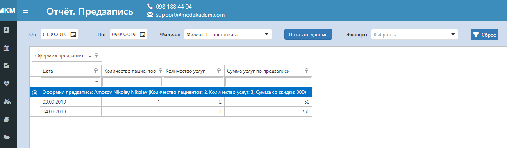

# Аналитика предзаписи

В этом отчете удобно отслеживать количество пришедших по записи пациентов, оформленных услуг и их сумму по конкретному пользователю.    
То есть если Вам нужно знать какой из регистраторов лучше или хуже работает, этот отчет Вам поможет.    
Все, что нужно для доступа к нему - это роль "Аналитика по предзаписи".   
 