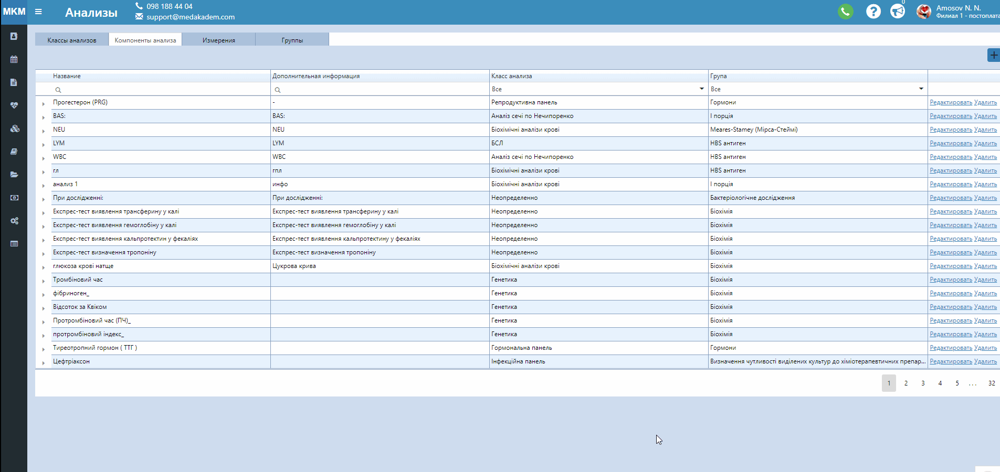

# Нормативы анализов

При добавлении новой услуги типа <a href="./Price">анализ</a> в пункте главного меню "Прайсы", вкладка "Услуги (краткий)", можно добавить компоненты этого анализа, которые будут исследоваться, из списка существующих.   
Чтобы добавить новый компонет анализа, зайдите в "Справочники" - "Анализы" - "Компоненты анализа". Здесь можно редактировать существующий компонент или добавить новый, добавить нормы для этого компонента. Для того, чтобы добавить компонент, нажмите "+", заполните все поля и нажмите "сохранить" в последнем столбце таблицы. Чтобы редактировать компонент, разверните нужный, нажав на стрелочку возле названия. Заполните все поля и сохраните. В форме лаборанта, и как следствие - в карточке пациента автоматически будет отображаться норма в зависимости от возраста и пола пациента. 
