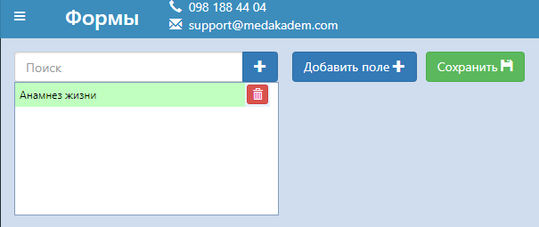
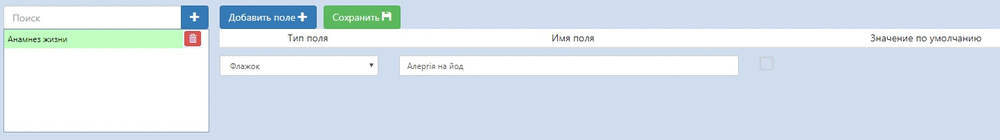
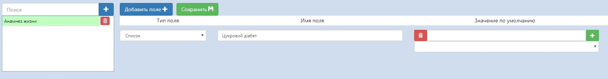
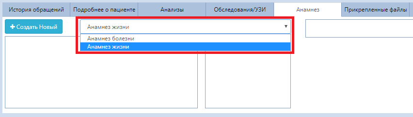
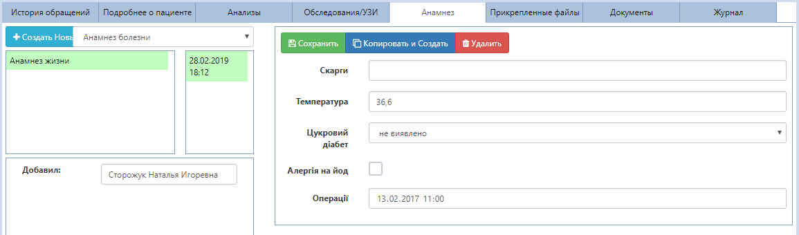

# Анамнез

Вы можете создавать разные виды анамнезов с помощью редактора форм. Кликните в пункте меню "Справочники" на вкладку "Формы". Чтобы создать новый вид анамнеза:
1. Введите название и нажмите "+".
2. Добавьте необходимые поля - строки опросника. 
3. Сохраните.   

   

При добавлении полей  есть возможность выбрать их тип. 
- **Поле для букв.** В таком поле можно будет вписывать вручную ответ в виде текста.
- **Поле для цифр.** Такой тип поля позволяет вносить лишь числовые значения.
- **Флажок.** Позволяет упростить ответ Да/Нет. Если ответ "Да", ставите "галочку". В обратном случае - флажок неактивен.   

- **Список.** Позволяет выбирать значения из выпадающего списка, которые можно добавить здесь же.   
Чтобы добавить значения в список, введите текст и нажмите "+".   

- **Дата/Время.** В таком поле можно указывать, например, дату последнего проявления симптомов заболевания.
 
 *Имя поля* - это вопрос пациенту, название строчки в анамнезе. Значение, которое Вы выставите в графе *"Значение по умолчанию"*, будет подставляться при добавлении нового анамнеза автоматически. Это касается всех типов полей.    
 Число в столбце *"Сортировка"* определяет позицию данного вопроса в анамнезе.

Чтобы добавить пациенту анамнез, зайдите в соответствующую вкладку в карточке пациента и:
1. Выберете нужный анамнез (определенный набор полей в опроснике).
 
2. Нажмите кнопку "Создать новый".
   

Все значения по умолчанию подставляются автоматически. Данные в анамнезе можно изменить и Сохранить. Кнопка "Копировать и создать" копирует существующий анамнез и создает на основе него такой же за текующую дату.   

В окошке слева отображаються все виды анамнезов, которые были добавлены этому пациенту. Кликнув на один из них, Вы увидите рядом все даты добавления этого вида анамнеза (анамнез можно открыть, кликнув на нужную дату).   

Отдельно взятый анамнез можно редактировать только в течении дня создания...