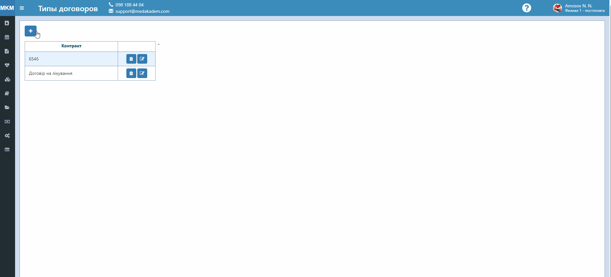
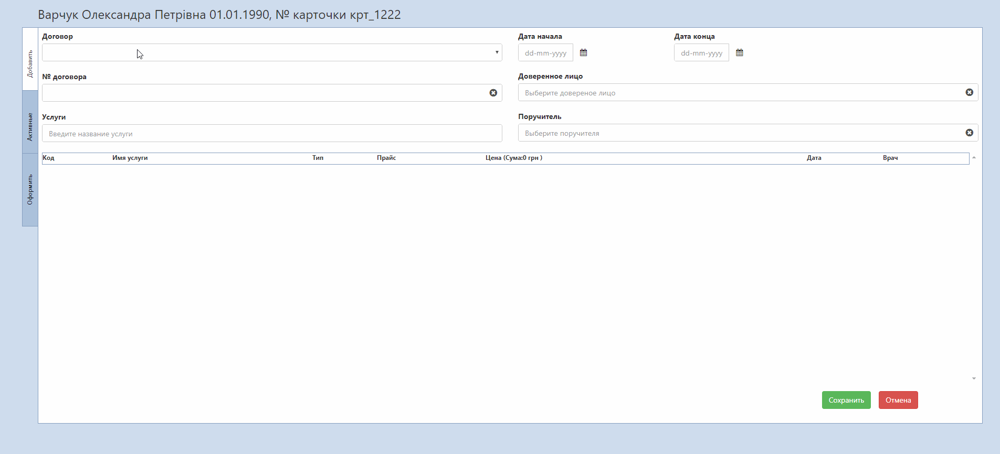

# Договора между клиникой и пациентом

В  случае, когда заключается договор на выполнение услуг, есть возможность отобразить это в программе.   
1. Создайте шаблон типового часто оформляемого договора для упрощения дальнейшей работы с оформлением договоров.   
Для этого:   
    - На вкладке справочники - > Типы договоров нажмите в колонке Контракты значок "+". Введите название типа договора. Кликните на значок "дискета", чтобы сохранить.
    - Кликните на тип, за которым нужно закрепить услуги. В появившемся справа поиске услуг, найдите нужную, начав вводить название услуги.   
    Выберете прайс и цену, которые будут подставляться автоматически.
    - Нажмите кнопку Сохранить в правом верхнем углу страницы.   
    

2. Оформите договор с пациентом.
    -  В списке пациентов нажмите правой кнопкой миши на нужного пациента и кликните в выпадающем списке на пункт Договора. В открывшемся окне на вкладке Добавить выберите тип договора, введите номер договора, даты начала и конца действия договора, доверительное лицо и поручителя (выбираются из списка пациентов).   
    Если нужно добавить услуги, которых нет в типовом договоре, выберите их в поле ниже.    
    В выбранных услугах можно изменить прайс/цену, выставить приблизительную дату выполнения услуги и врача, который будет проводить услугу. Нажмите Сохранить.   
    - После сохранения активируется вкладка Активные. Сдесь будут отображаться все оформленные на данного пациента договора. Выберите нужный.    
    В вкладке Инфо находится вся информация об этом договоре и статус услуг, которые входят в него - добавлено в договор, добавлено в  предзапись, услуга оформлена. Отсюда можно распечатать сам договор.   
    На следующей вкладке можно отредактировать всю имеющуюся информацию, кроме типа договора. Далее можно внести на счет договора деньги, чтобы иметь возможность оформить потом услугу из договора.
    