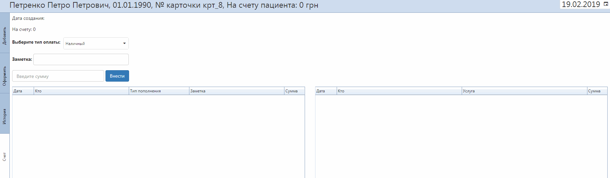
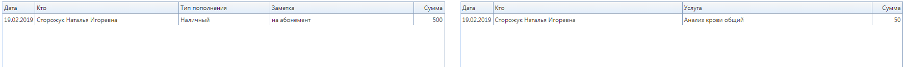

# Счет пациента
Программа дает возможность вести счет пациента. Сделать это можно  при открытии оформления заказа.
- Датой создания счета пациента считается дата, когда первый раз внесли сумму.
- Выберете способ пополнения счета (наличными или какой-то вариант безналичной оплаты).
- При необходимости можно добавить заметку (например причину пополнения).
- Введите сумму пополнения.   
      

Ниже расположены две таблицы с историей - пополнения в таблице слева и снятия со счета справа.   
В первой отображается дата пополнения, кто пополнил, тип оплаты, заметка, сумма пополнения. Во второй - дата оформления заказа через счет пациента, кто оформлял заказ, на какую услугу и сумму. 
    

Чтобы оформить заказ, снимая деньги со счета пациента, добавьте нужную услугу и в разделе "Оформить" измените тип оплаты.
