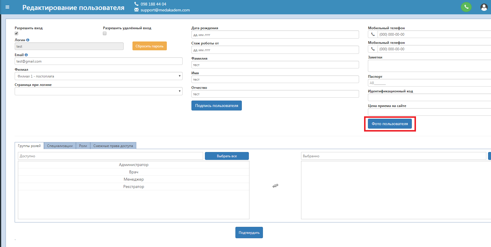
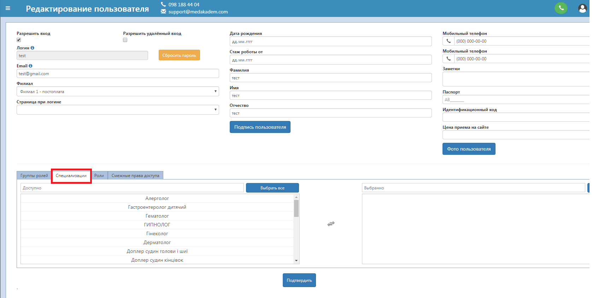
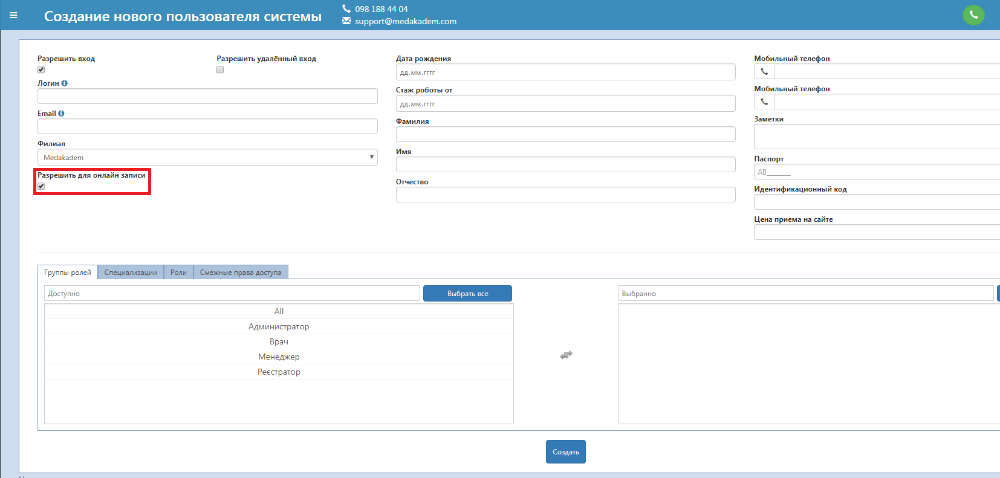

# Настройка пользователей врачей 

Для коректного отображения врачей на онлайн-сайте клиники настройте следующие параметры:   
1. Фото пользователя.   
    В Справочники - Пользователи выберете нужного врача. Кликнув два раза по нему, вы откроете окно редактирования  пользователя. Если нужно создать нового - перейдите <a href="./Users/index">сюда</a> . Чтобы загрузить фото, нажмите на соответствующую кнопку, потом "Загрузить", выбираете файл, настраиваете область и сохраняете.
    

2. Добавьте врачу его специализации. Это нужно для коректного отображения списка врачей при оформлении услуги, а также для отображения на онлайн-сайте.
    
    Если нужно добавить новую специализацию, это можно сделать на вкладке Справочники - Специализации врачей
    
    
    *Там же можно активировать отображение на онлайн-сайте, или наоброт скрыть эти специализации для онлайн-сайта. В последнем случае именно эти специализации не будут показаны для всех врачей, у которых они есть, на онлайн-сайте для пациентов.*
3. Стаж роботы.   
    Отображается на онлайн сайте при выборе специалиста для записи на приём. Заполняется в редактировании пользователя путем указания даты начала роботы. На сайте отображается автоматически подсчитанный стаж на текущий момент. 
4. Цена приёма.   
    В редактировании пользователя нужно указать цену приёма, которая будет показана как минимальная на онлайн-сайте.
5. Скрыть врача для онлайн-сайта.
    Чтобы конкретный врач не отображался в списке врачей на онлайн-сайте, зайдите во вкладку "Справочники" - "Пользователи", найдите нужного врача и снимите галочку в колонке "Онлайн". При создании нового пользователя или редактировании существующего есть пункт "Разрешить для онлайн записи" - снимая галочку здесь, вы также скрываете врача для онлайн-сайта.   
    