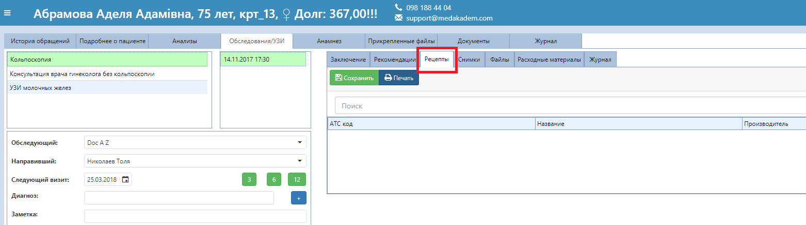
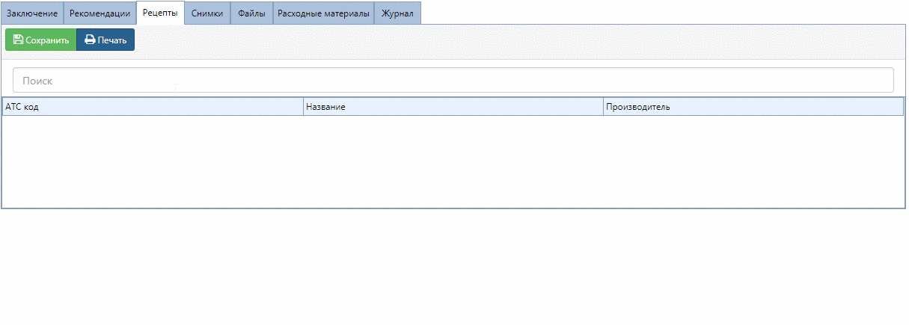
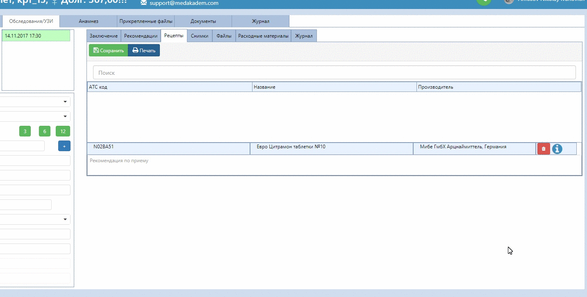

# Рецепты

К каждому протоколу приема врача можно прикрепить рецепт на лекарственные средства с рекомендацией по применению.    

Открыв нужный протокол, зайдите на вкладку "Рецепты".   
       

В строке поиска введите часть названия лекарственного средства. Система отображает АТС классификацию лекарств, полное его название, а также фирму и страну производителя.   
   
выберите в списке нужный, кликнув на него. Добавленные лекарства появлаются ниже.    

В том же окошке добавленного средства можно указать рекомендации по приёму.   
Нажатие на кнопку "і" открывает инструкцию по применению от производителя.      

После сохранения рецепта его можно распечатать.