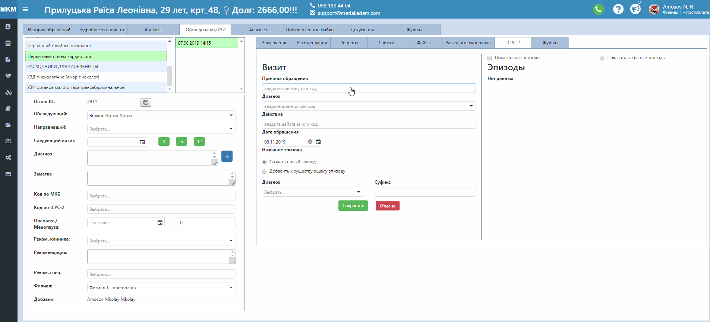

# ICPC-2. Эпизоды и визиты

На этой вкладке в карте пациента можно производить классификацию обращений по международной системе.   
Визитом считается каждое отдельное обращение пациента в клинику. В программе Clinica Web визиты привязываются к оформленным услугам. То есть, если пациенту оформили, например, консультацию аллерголога, нужно открыть именно эту услугу, чтобы создать визит.   
Для создания визита:   
1. Найдите в списке **причину обращения** по коду или названию, соответственно классификации. Кодов причин обращений можно выбирать несколько. То же касается и **действий** после обращения.
2. **Диагноз** выбирается только один. 
3. Выберите, хотите ли Вы создать новый **эпизод** или же добавить к существующему.   
Эпизод медицинской помощи (ЭМП) - это взаимодействие пациента с медицинским учреждением от первого
обращения (визита) к медицинскому работнику и до последнего визита (включительно) с этой же проблемой (заболеванием).
4. В случае создания нового эпизода, выберите соответствующий вариант. Название эпизода автоматически использует название диагноза. При необходимости, введите суффикс (приставку к названию). 
5. Нажмите Сохранить.
6. В случае добавления созданного визита к существующему эпизоду, выберите название нужного эпизода и нажмите Сохранить.   
Созданные эпизоды будут отображаться на той же вкладке в правой части страницы.   

Действия с эпизодами:    
- **Редактирование эпизода**. Нажмите на значок. В открывшемся окне можно изменить название эпизода, выбрав другой диагноз для эпизода, или изменить суффикс.
- **Закрытие эпизода**. Нажмите на значок. В открывшемся окне выберите дату завершения эпизода и нажмите Закрыть эпизод.    
Закрытые эпизоды нельзя редактировать или открыть заново. Их можно увидеть, активировав поле Показать закрытые эпизоды сверху вкладки.
- **Перемещение визита**. При необходимости можно переместить созданный визит в другой эпизод. Нажмите на значок  в строке с нужным визитом. В открывшемся окне выберите куда перемещать(по названию эпизода).

*По умолчанию в открытой услуге будут показываться только связанные с ней эпизоды. Чтобы увидеть все эпизоды данного пациента, активируйте поле Показать все эпизоды.*