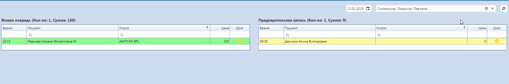

# Функционал программы

| Регистратура       | Врач              | Лаборант            | Call центр             |
|:------------------|:------------------|:--------------------|:-----------------------|  
| Список пациентов  | Форма врача       | Форма лаборанта     | Предварительная запись |  
| Оформление заказа | Карточка пациента | Нормативы анализов  | IP телефония           |
| Отчёты            | Печать протокола  | Результаты анализов | Запись через сайт      |

- Главная
  
  - Список пациентов
    - [Поиск пациента](https://medakadem.github.io/ClinicaWeb/PatientSearch "Поиск пациента") 
    - Добавление нового пациента
     
    - [Оформление заказа](https://medakadem.github.io/ClinicaWeb/Order "Оформление заказа")  
    - [Объединение карточек пациентов](https://medakadem.github.io/ClinicaWeb/PatientIntegration "Объединение карточек пациентов")
    - Обновить информацию
    - Контекстное меню
      - Оформление заказа
      - Редактировать пациента
      - Открыть карточку пациента
      - Объединить карточки
      - Удалить пациента 
      - [Добавление пациента в чёрный список](https://medakadem.github.io/ClinicaWeb/BlackList "Добавление пациента в чёрный список пациента")
      - Печать
        - Контекстное меню
          - Направления на обследования
          - Направления на анализы
          - Распечатать карточку пациента
          - Распечатать соглашения
  - Приём врача  
  Здесь врач или регистратор может видеть количество и список пациентов, записавшихся к указаному врачу по предварительной записи, а также в порядке живой очереди на конкретную дату
  
  - Форма лаборанта  
  Здесь лаборант может вносить результаты анализов. Выбрав клинику, лабораторию, период отображения, группы анализов можно легко найти нужный анализ. Также можно искать по фамилии пациента, дате создания и коду уже в самой таблице анализов. Для заполнения результатов, открыть нужный анализ и кликнуть по нужной ячейке.
  
  - Предварительная запись
  В даном окне регистратор может записывать пациентов к врачу. Выбрав пациента, филиал,и дату отображения, кликнуть на нужное время записи. Можно фильтровать отображаемых врачей по специализации либо по фамилии.
   
    - Оформление пред.записи
  При предварительной записи не оформляется сама услуга. При нажатии на нужную предзапись из этой вкладке, открывается вкладка "[Оформление заказа](https://medakadem.github.io/ClinicaWeb/Order "Оформление заказа")"  
  - (Устаревшая) Пред.запись
- Календарь
    - График работы врачей
    - Выбор клиники
    - Выбор врача
    - Выбор даты графика
    - Экспорт графика работы врачей
    - Выбор по времени
    - Выбор клиники
    - Экспортировать график
    - Экспортировать всё
    - Экспортировать выбранные строки
    - Запись к врачу
    - Дата записи
    - Выбор врача
    - Импортировать запись
- Отчёты
    - Отчёт врача
    - Наличные
    - Анализы
    - Обследования
    - Сводный
    - Контрагенты
    - Отчёт по долгам
    - Отчёт история изменений
    - Отчёт предзаписи
    - Отчёт материалы
    - Контрагенты сводный
    - Направившие
    - Диспансерный (повторных визитов)
    - Менеджер
- Справочники
    - [Типы обращений](https://medakadem.github.io/ClinicaWeb/TypeSurvey "Типы обращений")
    - [Контрагенты](https://medakadem.github.io/ClinicaWeb/Contractor "Контрагенты")
    - [Направившие врачи](https://medakadem.github.io/ClinicaWeb/ReferringDoctors "Направившие врачи")
    - [Группы ролей](https://medakadem.github.io/ClinicaWeb/RoleGroup "Группы ролей")
    - Скидки
    - [Лаборатории](https://medakadem.github.io/ClinicaWeb/Labs "Лаборатории")
    - Полисы СК
    - [Анализы](https://medakadem.github.io/ClinicaWeb/Analyzes "Анализы")  
    - [Кабинеты](https://medakadem.github.io/ClinicaWeb/Rooms "Кабинеты")
    - [Клиники](https://medakadem.github.io/ClinicaWeb/Clinic "Клиники")  
    - [Пользователи](https://medakadem.github.io/ClinicaWeb/Users "Пользователи")
    - [Специализации врачей](https://medakadem.github.io/ClinicaWeb/DoctorSpecialization "Специализации врачей")
- Шаблоны
    - Шаблоны SMS
    - Печать документов
    - Печать контрагентов
    - Печать пакетов (комплексов)
    - Протоколов врачей

- Прайсы
    - Прайс
    - Ценовые группы
    - Услуги (детальный)
    - [Услуги (краткий)](https://medakadem.github.io/ClinicaWeb/Price "Услуги (краткий)")
    - Материалы
    - [Импорт прайса](https://medakadem.github.io/ClinicaWeb/PriceImport&Export "Импорт прайса")
    - Разделы прайса