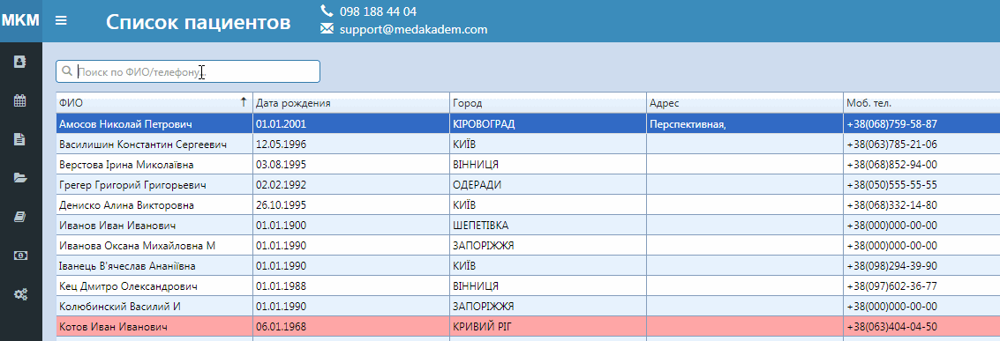
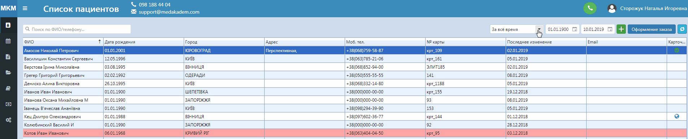
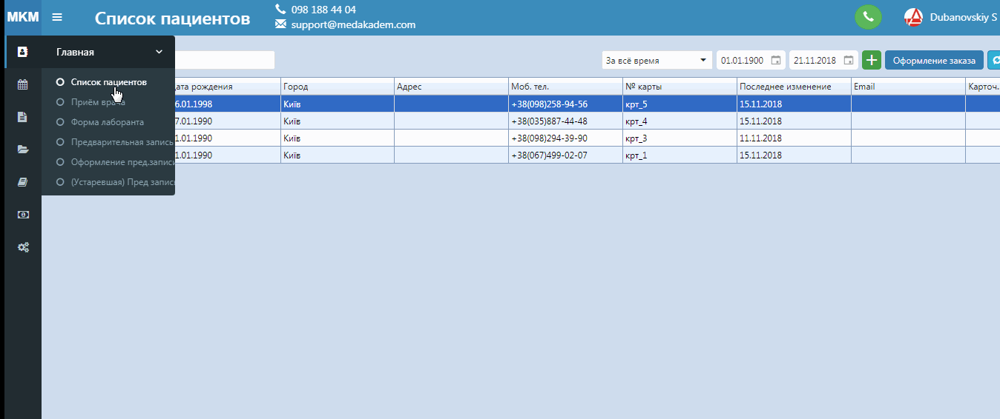
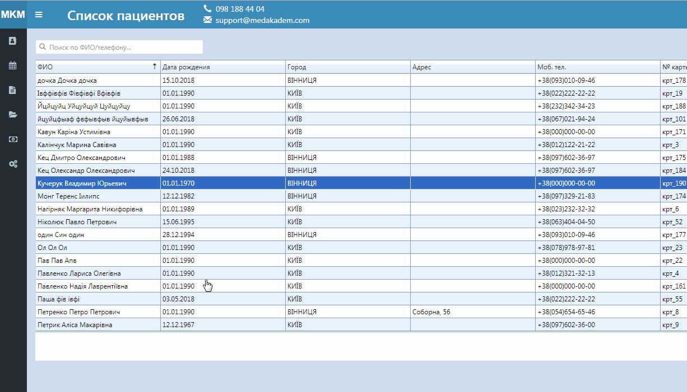
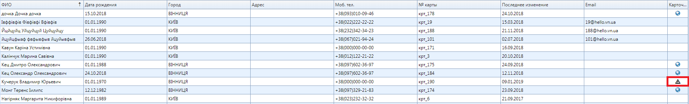
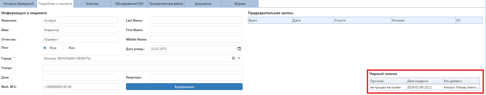

# Функционал программы

| Регистратура       | Врач              | Лаборант            | Call центр             |
|:------------------|:------------------|:--------------------|:-----------------------|  
| Список пациентов  | Форма врача       | Форма лаборанта     | Предварительная запись |  
| Оформление заказа | Карточка пациента | Нормативы анализов  | IP телефония           |
| Отчёты            | Печать протокола  | Результаты анализов | Запись через сайт      |

- Главная
  - Список пациентов
  - Приём врача
  - Форма лаборанта
  - Предварительная запись
  - Оформление пред.записи
  - (Устаревшая) Пред.запись
  - Список пациентов
    - Поиск пациента  
    Поиск пациента можно совершить таким способом. В списке пациентов есть поле поиска по фамилии или телефону. 
     
    Также можно выбрать за какой период отображать список пациентов. Этот фильтр работает по дате последнего изменения в карточке пациента.
      
    - Добавление нового пациента
     
    - Добавление пациента в чёрный список
     
    Увидеть, что пациент уже в черном списке можно по значку в списке пациентов
     
     а также в карточке пациента во вкладке "Подробнее о пациенте":
     
    - Оформление заказа
    - Объединение карточек пациента
    - Обновить информацию
    - Контекстное меню
      - Оформление заказа
      - Редактировать пациента
      - Открыть карточку пациента
      - Объединить карточки
      - Удалить пациента
    - Печать 
    - Контекстное меню
      - Направления на обследования
      - Направления на анализы
      - Распечатать карточку пациента
      - Распечатать соглашения
  - Календарь
    - График работы врачей
    - Выбор клиники
    - Выбор врача
    - Выбор даты графика
    - Экспорт графика работы врачей
    - Выбор по времени
    - Выбор клиники
    - Экспортировать график
    - Экспортировать всё
    - Экспортировать выбранные строки
    - Запись к врачу
    - Дата записи
    - Выбор врача
    - Импортировать запись
  - Отчёты
    - Отчёт врача
    - Наличные
    - Анализы
    - Обследования
    - Сводный
    - Контрагенты
    - Отчёт по долгам
    - Отчёт история изменений
    - Отчёт предзаписи
    - Отчёт материалы
    - Контрагенты сводный
    - Направившие
    - Диспансерный (повторных визитов)
    - Менеджер
  - Справочники
    - Типы обращений
    - Контрагенты
    - Направившие врачи
    - Группы ролей
    - Скидки
    - Лаборатории
    - Полисы СК
    - Анализы
    - Кабинеты
    - Клиники
    - Пользовватели
    - Специализация врачей
  - Шаблоны
    - Шаблоны SMS
    - Печать документов
    - Печать контрагентов
    - Печать пакетов (комплексов)
    - Протоколов врачей

  - Прайсы
    - Прайс
    - Ценовые группы
    - Услуги (детальный)
    - Услуги (краткий)
    - Материалы
    - Импорт прайса
    - Разделы прайса