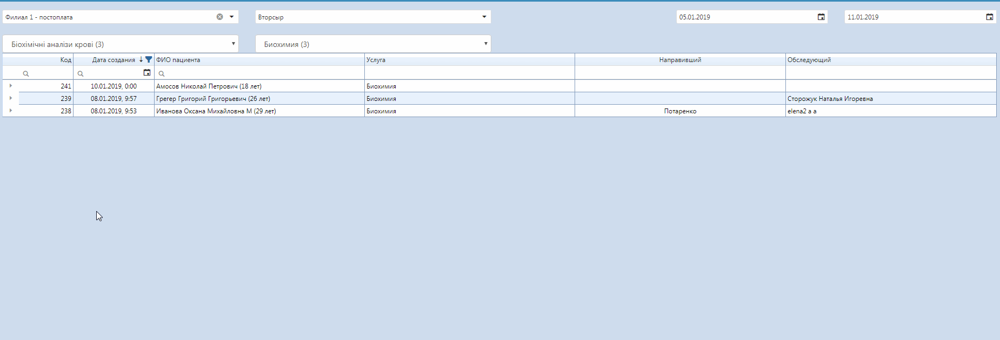
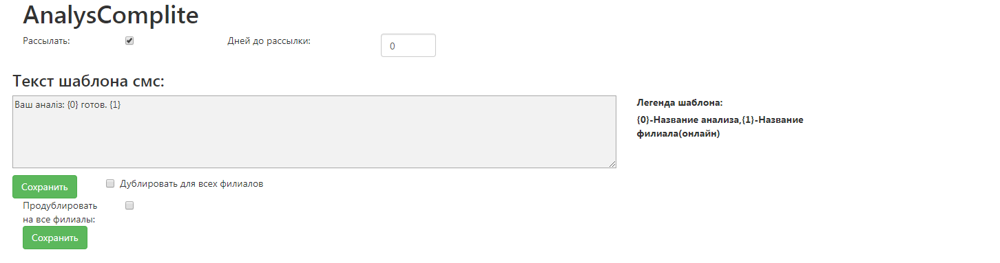
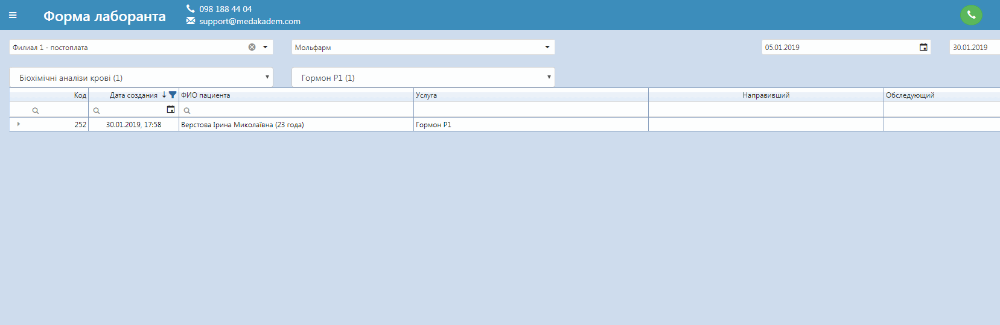

# Форма лаборанта

## Результаты анализов
Здесь лаборант может вносить результаты анализов. Выбрав клинику, лабораторию, период отображения, группы анализов можно легко найти нужный анализ. Также можно искать по фамилии пациента, дате создания и коду уже в самой таблице анализов. Для заполнения результатов, открыть нужный анализ и кликнуть по нужной ячейке.
     
При заполнении результатов анализа выделяются красным цветом те, которые выходят за норму. Нормы анализов выставляются в специальном справочнике. Как создать и заполнить компоненты анализов можно узнать <a href="./analyzesnorm">здесь</a>.   
Для удобной работы с таблицей можно фильтровать отображение анализов данного пациента - все анализы, по выбранной ранее услуге, за выбранный день. Стрелками на клавиатуре можно осуществлять навигацию по ячейкам таблицы. При изменении данных в ячейке, она выделяется зеленой рамкой, чтобы было видно, что сохранится в итоге.   

## Статус готовности анализов

Для того, чтобы выставить статус анализа, который сообщает, что он готов, нажмите правой кнопкой на нужный анализ и выберете пункт контекстного меню "Готов". При этом автоматически пациенту отправляется СМС-сообщение на мобильный телефон, текст которого может выглядеть так:

Данные, обозначенные цифрами и описанные в легенде <a href="./shablonysms">шаблона</a>, подставляются автоматически.   

При выборе после этого статуса "Подписать", в форму результатов анализов, которая выводится на печать, добавляется подпись ответственного лаборанта.  

  

Если изначально выбрать "Подписать", это означает, что ответственное лицо проверил готовые результаты анализов. То есть будет отображено два статуса - "Готов", "Подписан".

