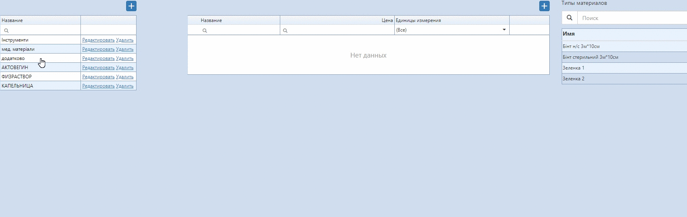
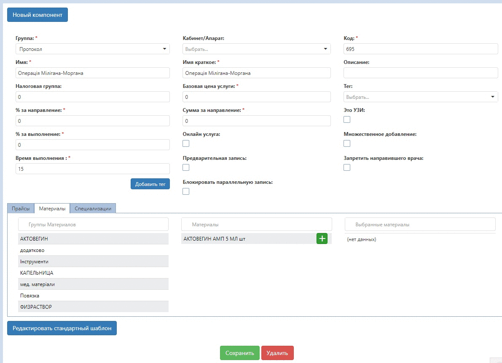
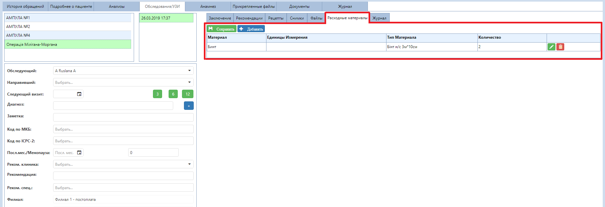

# Материальный учёт

Для того, чтобы добавить новые позиции материалов-расходников

1. Зайдите на вкладку "Прайсы" - "Материалы".
2. Первая таблица слева позволяет создать группы материалов. Просто нажмите на "+", введите название группы и сохраните.
3. Выбрав нужную группу материалов, в центральной таблице добавляем сами материалы. Кликните на "+", введите нужные данные, сохраните. Если развернуть каждую позицию, можно добавить типы кажого материала, которые редактируются в таблице справа.

Далее на вкладке "Услуги(краткий)" в нужные услуги добавляйте материалы с указанием их количества, которое по умолчанию уходит при проведении даной услуги.

В карте пациента уже можно изменить эти данные на вкладке Материалы при открытии нужного протокола или анализа.

