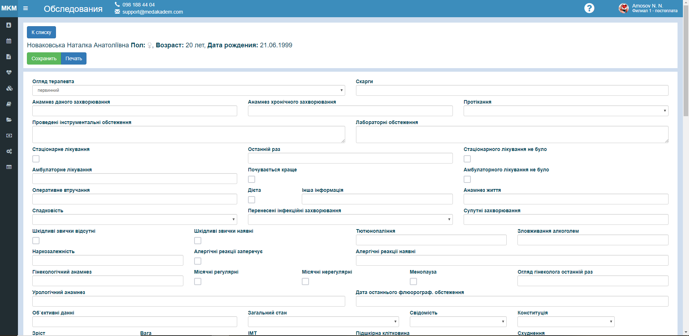

# Рабочее место медсестры

Этот модуль представляет собой удобную портативную версию страницы заполнения анамнеза пациента для работы на планшетных устройствах.       
  
Здесь, выбрав дату и лаборанта, на которого оформили услугу пациентам, можно увидеть список пациентов с возможностью быстрого перехода в прикрепленную к этой услуге форму  анамнеза.     
Отсюда же можно быстро распечатать заполненную анкету пациента.  
