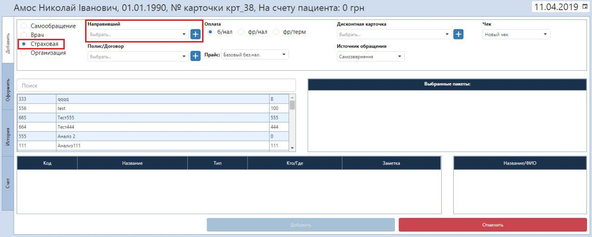
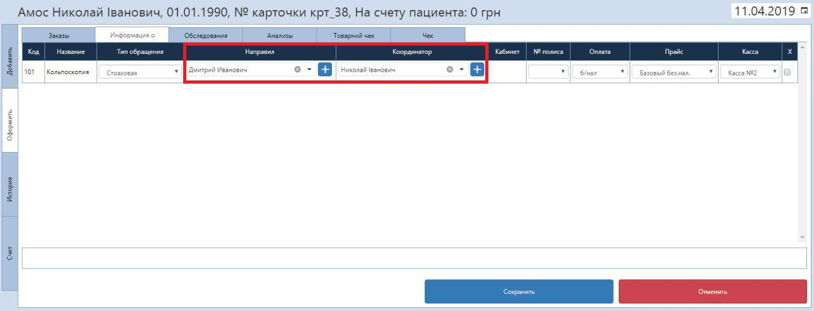

# Изменения в оформлении заказа

<html>
      <head>
      </head>
    <body>
    Изменения вступят в силу в субботу, 15.04.2019. 
    </body>
</html>

При оформлении услуги по страховой теперь можно выбрать ТОЛЬКО направившего врача.    
Теперь отдельно можно указать координатора который гарантирует визит. Выбрать координатора можно только после оформления услуги.
Так же направившие и координаторы теперь не будут пересекаться и будут доступны в соответвующих справочниках.
1. Добавьте услугу по типу обращения "Страховая".   

2. На следующей странице "Оформить" на вкладке "Информация о" можно выбрать и направившего врача, и координатора от страховой.

   

Теперь в отчетах отображаются координаторы так же, как и направившие.
 
