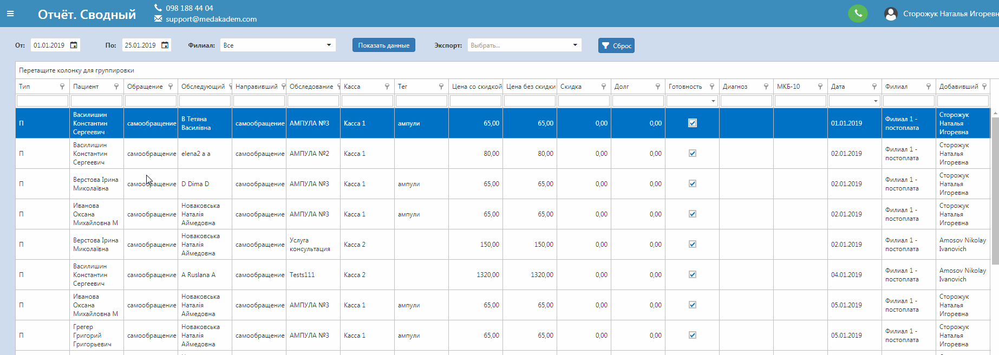
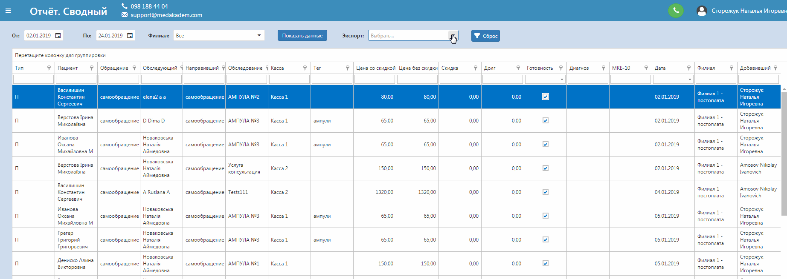
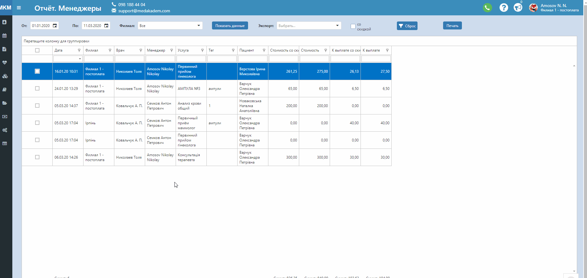

# Отчёты

В этой вкладке содержатся отчеты по данным в зависимости от цели их использования. Рассмотрим работу с отчетами на примере отчета "Сводный", в котором находится большинство нужных данных.   
1. Выберете период времени, за который нужно отображать данные (не более трёх месяцев).
2. Выберете конкретный филиал клиники или вариант, при котором отображаются данные со всех филиалов.
3. Кликните на кнопку "Показать данные".   
Далее можно выбрать колонки, по которым будут группироваться данные. Первая колонка, которую Вы перетащите на поле для группировки и будет высшей ступенью иерархии.

Также можно фильтровать по каждой колонке, выбрав какое-то значение из списка.   
Если нужно вернуться к первоначальному виду данных, нажмите "Сброс".   

Для удобной дальнейшей работы с этими данными, их можно экспортировать на компьютер в выбраном формате. 

## Отчёт менеджера

 Этот отчёт существует для контроля выплат направившим врачам. У каждого направляющего врача должен быть указан менеджер, чтобы он отобразился в данном отчёте.     
 *Создать направляющего врача и редактировать существующего (например указать менеджера) можно в Справочники - > Направившие врачи.*    
 Работа с печатью отчёта:   
- Выберите по каким пациентам/направившим врачам Вы хотите напечатать отчёт и проставьте в выбранных строках "галочки" в первой колонке. Нажмите "Печать".
- Вы можете сначала сгруппировать по колонке "Врач", чтобы иметь возможность быстро найти нужного направившего.
- Настройте отображение отчёта, удобное для Вас - фильтруйте по нужным данным, чтобы легко найти нужную информацию.
- При печати есть возможность настроить отображение стоимости услуги со скидкой или без. То есть если Вы не отметите "галочкой" в верхней части страницы поле "со скидкой", то при печати стоимость услуги и сумма к выплате будут считаться без учета скидки. Но если активировать поле "со скидкой", то при печати в колонках стоимость и к выплате будет подставляться сумма с учетом скидки на услугу.
