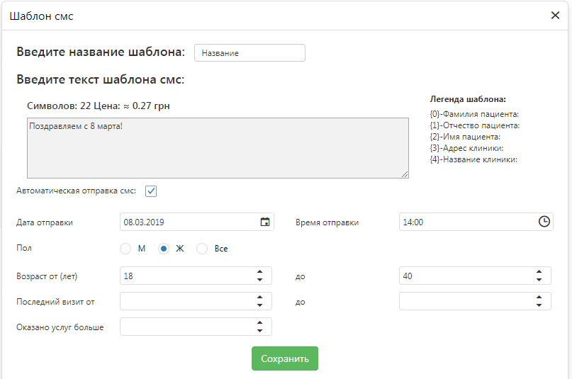

# Шаблоны SMS рассылки

В программе есть набор готовых шаблонов СМС, которые можно использовать в Ваших целях, а также есть возможность создавать свои уникальные шаблоны рассылки.    
Эти шаблоны разделены соответственно по вкладкам "Системные" и "Пользовательские".   
## Системные
 В системных можно редактировать текст самого шаблона, активировать рассылку и выбрать за какое количество дней до события, описанного в шаблоне, осуществлять рассылку. Например, за день до предстоящего визита к врачу отправлять СМС с данными о дате, времени предзаписи, фамилии обследующего врача и адреса клиники. В легенде описаны данные, которые будут автоматически подставляться, если ввести нужную комбинацию символов. Значок "галочка" возле названия шаблона означает, что рассылка по этому шаблону активирована.   
   
*Пример системного шаблона*
   
*Редактирование системного шаблона*   

## Пользовательские
На вкладке "Пользовательские" содержатся созданные Вами шаблоны. 

*Пример пользовательского шаблона*   

**Чтобы создать новый шаблон** :
1. Кликните на кнопку "Создать шаблон".
2. Введите название шаблона
3. Введите текст шаблона, используя по надобности комбинации символов, указаные в легенде.     

Такие шаблоны будут отправляться в единичных конкретных случаях, кликая на вкладке "Оформление предзаписи" на нужного пациента правой кнопкой мыши.   

4. Активируйте автоматическую отправку СМС, если требуется. Ниже появятся фильтры, которые помогают системе сортировать кому отправить такие смс. В последствии можно рассчитать количество смс, которые отправятся людям, отобранным по этим фильтрам.    
    - выберете дату и время отправки этого смс (обязательное поле для этой функции);
    - можете выбрать пациентам какого пола отправлять;
    - укажите интервал возраста пациентов(можно указать тольку одну границу);
    - интервал времени, за который был осуществлен последний визит, считая назад от сегоднешнего дня;    
    Например нужно отправить смс пациентам, которые были в клинике последний раз считая от сегодня и до двух недель назад - ставим от 0 до 14; если нужно выбрать пациентов, которые были в клинике от месяца до двух назад - ставим от 30 до 61.   
    Здесь тоже можно выбрать лишь одну границу. Например отправлять СМС пациентам, которые были больше месяца назад (ставим от 30).
    - минимальное количество услуг, оказанных пациенту.    
    
   
*Пример создания шаблона*
5. Сохраните шаблон.
