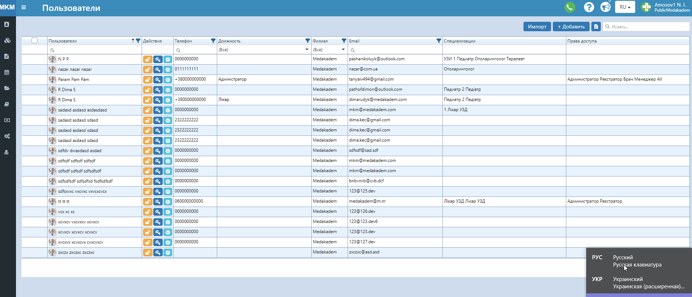
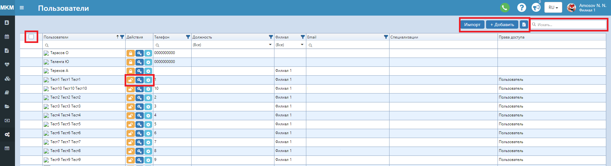

# Пользователи 

## Добавить пользователя 
Во вкладке главного меню "Справочники" выберите пункт "Пользователи". Нажмите "+ Добавить", откроется окно создания поверх таблицы. Далее есть несколько шагов для  создания. 

### ШАГ 1. Основное   
Обязательные поля для заполнения:
1. ФИО пользователя.
2. Действующий E-mail, на который будет отправлен созданный логин и пароль.
3. Логин нового пользователя для входа в программу.
4. Филиал, на котором работает пользователь.
5. Должность.  
Активация опции "Разрешить вход" разрешает вход в программу для этого пользователя. Соответственно опция "Разрешить удалённый вход" разрешает вход в программу с других устройств.   
Можно ввести дату рождения пользователя, мобильный телефон (для отправки СМС при удаленном входе), паспортные данные.   
Поле "Начальная страница" настраивает страницу, которую пользователь будет видеть при входе в программу.   
"Порядок в предзаписи" определяет положение графика роботы врача на странице предзаписи. Если, к примеру, есть врачи, к которым чаще всего записываются, можно им просить значение поля от 1 до 5. Тогда они, независимо от порядка алфавита, будут показаны первыми.    
"Продолжительность приема" будет подставлятся при создании графиков работы.   
*После введения всех данных нажмите **Сохранить** и Далее.*

### ШАГ 2. Online
Данный шаг актуален для клиник с подключенным функционалом онлайн-кабинета для пациентов.    
1. Для того, чтобы созданные графики работы данного врача показывались на онлайн-сайте для записи, поставьте галочку "Доступен для онлайн записи".
2. Выставьте стоимость приема врача.
3. Рейтинг врача для сортировки (чем меньше цифра, тем выше рейтинг).
4. Стаж работы - укажите дату начала роботы, стаж посчитается автоматически.

### ШАГ 3. Оповещения
Укажите галочками варианты рассылок, актуальные для пользователя.

### ШАГ 4. Специализации
На этом шаге можно присвоить врачу его специализации.
1. В блоке слева возпользуйтесь поиском, чтобы найти нужные специализации и нажмите на "+". При этом они появятся в верхнем блоке, в котором отображаются добавленные специализации. 
2. Если нажать на саму специализацию, в блоке справа появится список услуг, к которым она привязана. 

### ШАГ 5. Безопасность
Здесь необходимо выдать пользователю соответствующую группу ролей (прав доступа).    
По аналогии с предыдущим шагом:
1. В блоке слева выберите группу и нажмите на "+". Группа применится и появится в верхнем блоке. 
2. Если нажать на саму группу, в блоке справа появятся роли (конкретные права), которые в нее входят.    

*Создавать группы ролей можно в Настройки - Группы ролей". Как это сделать, смотрите <a href="./RoleGroup">здесь.</a>*

### ШАГ 6. Мат.учет
Этот шаг актуален для клиник с включенным функционалом ТМЦ.   
Для корректной работы с данным функционалом, пользователя нужно привязать к складу, с которым он может работать. 
1. Найдите необходимый склад по названию в поиске. Также можно отфильтровать список складов по филиалам. 
2. Нажмите "+". Справа покажется выбранный склад.

### ШАГ 7. Смежные права
По умолчанию все врачи могут редактировать только те заключения, которые были оформлены на них. Здесь же можно отметить заключения каких еще врачей этот пользователь может редактировать.
1. Воспользуйтесь поиском, чтобы найти нужного врача.
2. Нажмите "+". Выбранные врачи покажутся в блоке справа.

## Работа с таблицей

- В верхней части, над таблицей, есть поле для поиска по всей таблице, кнопка добавления нового пользователя, возможность импортировать файлом новых пользователй, а также экспортировать имеющуюся таблицу.
- Выделите в первой колонке галочками нескольких пользователей, чтобы : Заблокировать или Разблокировать вход для выделенных людей; удалить их с программы. Кнопка "Очистить" очищает выделение строк.
- В колонке "Действия" есть три кнопки: первая блокирует/разблокирует вход для пользователя; при помощи второй можно сбросить новый случайный пароль для пользователя; третья открывает контекстное меню.
- В контекстном меню есть возможность открыть редактирование основной информации о пользователе , открыть блок прав доступа, а также блок специализаций.  

## Импорт пользователей

1. Нажмите на кнопку Импорт над таблицей.
2. В открывшемся окне нажмите на Шаблон, чтобы скачать шаблон(пример) файла для заполнения.
3. Заполните таблицу данными о пользователях. 
4. В том же окне нажмите Выбрать файл и выберите заполненный файл.
5. Нажмите Загрузить.