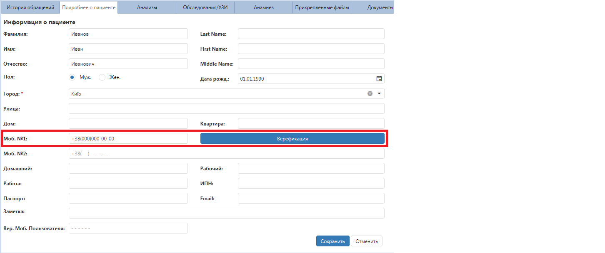

# Верификация пациентов

Для подтверждения действительности номера пациента в его карточке на вкладке "Подробнее о пациенте":   
1. Нажмите на кнопку "Верификация" возле первого и основного номера телефона.  
  
Пациенту на этот номер придет СМС-сообщение вида : "Ваш код верификациии: ХХХХ", где ХХХХ - четырехзначный числовой код.
2. Введите код в открывшееся окно верификации и нажмите "Проверить".   
 Если код верный, кнопка "Верифицировать" станет неактивной и изменить надпись на "Верифицирован".    

После успешной верификации автоматически создается электронная карта пациента на онлайн-сайте клиники. При этом пациенту приходит смс с логином и паролем для входа на сайт.